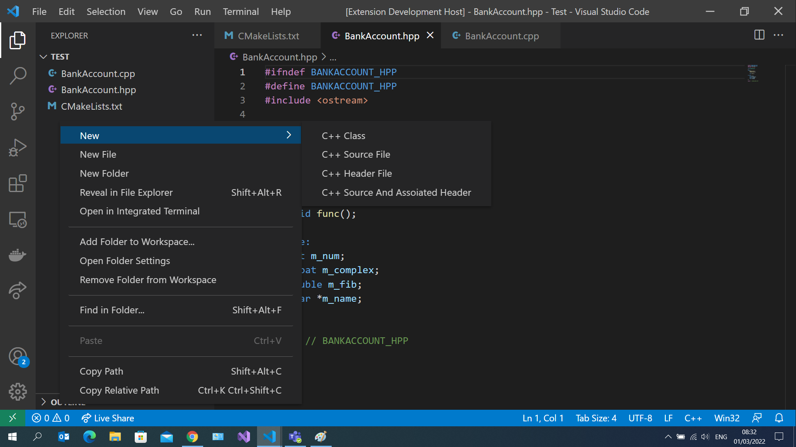
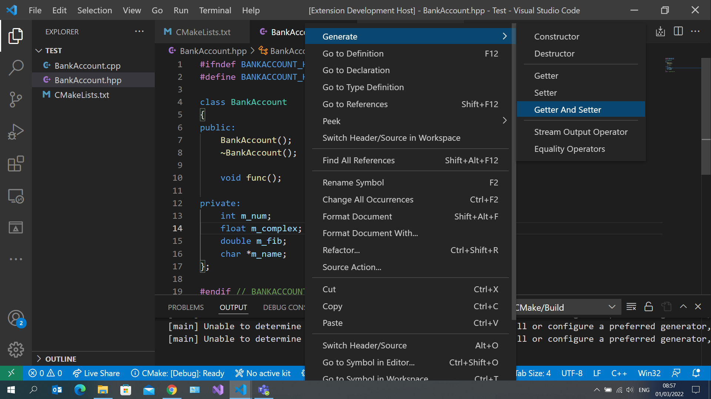

# class-generator README
this extension generate for you files, class and function.

## Features
this extension add 2 main features to your menu.

1. the 'NEW' menu when Right-click on the 'EXPLORER' menu.

after choosing what kind of file/class to create, you have the option with input box to choose if add the files to the CMakeLists.txt.

2. the 'Generate' menu when Right-click on the code area.

after choosing what kind of function to generate, you also can choose where you want the implementation (inline/source/header), and witch class members to include in that function.

## Requirements

1. the class members must start with m_.
2. they must be under 'private:'.
3. if you want to add to CMakeLists.txt, he nust have the 'add_exacutable()' written.

## Release Notes

### 1.0.0

Initial release of ...

-----------------------------------------------------------------------------------------------------------

**Enjoy!**
